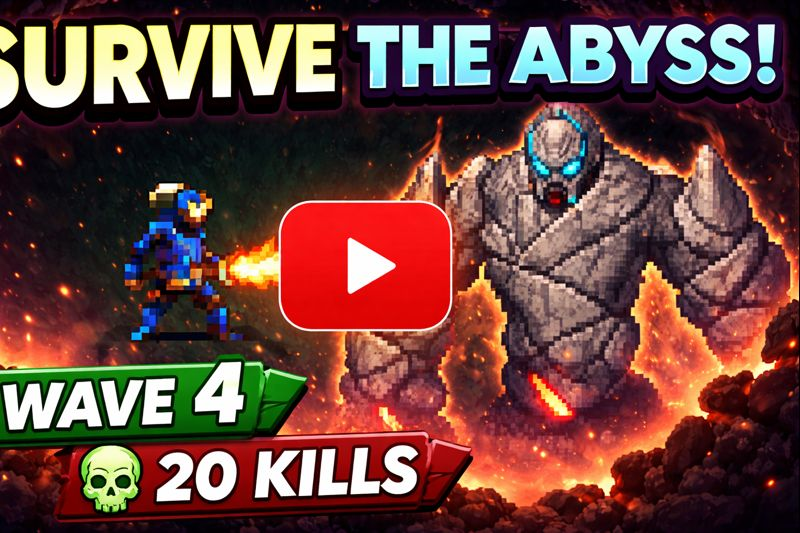

# Survive the Abyss

**Survive the Abyss** is a fast-paced wave-based survival arena game developed in **Godot Engine** for a game jam.

The darkness is endless — only your will to fight can keep you alive.  
Face relentless waves of enemies, collect powerful weapons, and survive long enough to confront the final boss lurking deep within the abyss.

---

## 🎮 Gameplay Preview

---

## ⚔️ Features
- Wave-based survival with increasing difficulty  
- Multiple weapons: **Sword, Axe, Scepter, Great Sword**  
- Weapon pickup and drop system  
- Health potion pickups during combat  
- A climactic final boss fight  

---

## 🎮 Controls
- **Move:** W / A / S / D or I / J / K / L  
- **Attack:** Tab or Space  
- **Pick / Drop Weapon:** E or Q  

---

## ℹ️ Notes
- The **Sword** is the base weapon and cannot be dropped  
- The **Axe** deals more damage than the Sword  
- The **Scepter** fires projectiles and deals more damage than the Axe  
- The **Great Sword** delivers the highest damage in the game  

---

## 🧪 Project Status
> **Note:** This project was developed for a game jam and completed within a short time frame.  
> As a result, some areas may feel unpolished or incomplete.  
> The project is stable and serves as a foundation for future improvements and experimentation.

---

## 🔧 Tech Stack
- **Engine:** Godot  
- **Language:** GDScript

---

## 👥 Contributors & Credits
- **Priyansh Singh** — Game Programming, Core Mechanics, Systems Design  
- **Hayden Gaxiola** — Music Composition

